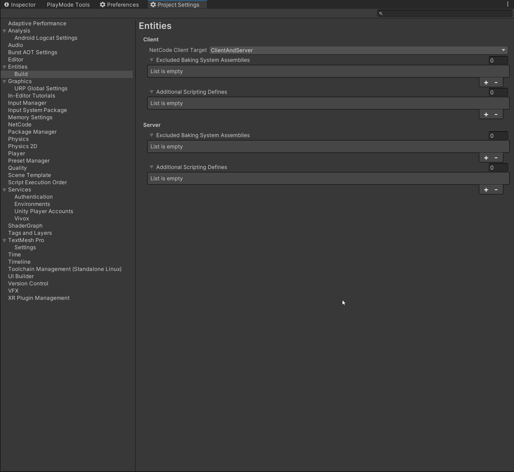

## Contents and Quick Links

- [Game Assemblies](#game-assemblies)
- [Authoring Assemblies](#authoring-assemblies)
- [Excluding Baking System Assemblies](#excluding-baking-system-assemblies)

## Game Assemblies

All Megacity Metro assemblies were organized to include only the specific scripts designated for each **Client Target** during compilation. The project categorizes them into Client, Server, and a Mix for assemblies shared by both Client and Server.

Simultaneously, a unified assembly was created to store all gameplay entity components. These components are utilized by Authoring scripts attached during the creation of the Entities cache. Given that these components are also essential during the game's runtime, this assembly is included in the build.

## Authoring Assemblies

Another distinct assembly is dedicated solely to Authoring scripts. It operates during cache creation, converting game objects into Entities. It's essential to note that, as part of the Editor, these scripts are not expected to create dependencies on the scripts compiled for Runtime.

## Excluding Baking System Assemblies

To exclude baking system assemblies:

In `Project Settings > Entities`, within each section, you can exclude the baking assemblies to prevent their accidental inclusion in the build. This process aids in identifying and preventing any unintended dependencies between assemblies. Notably, Unity Editor enables the creation of a list per **Client Target** when excluding assemblies.

