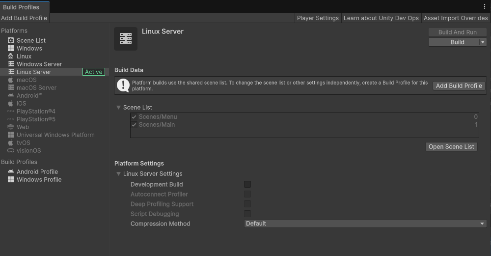

## Contents and Quick Links
- [Build Local Multiplayer Setup](#build-local-multiplayer-setup)
- [Editor Local Multiplayer Setup](#editor-local-multiplayer-setup)
- [Launching Server builds locally](#starting-a-server-locally)

## Multiplayer Setup

Megacity Metro is server-authoritative, which means the server has ultimate authority and control over the game's state and rules. To test the game, a server needs to be running, and clients need to connect to the server. This can be done in the Editor, locally, or through Multiplay Hosting.

> NOTE!: Megacity Metro now relies on the new Session API introduced in the [Multiplayer Services SDK](https://docs.unity.com/ugs/en-us/manual/mps-sdk/manual) package. Sessions require you to set up UGS for local development too.

### Build Local Multiplayer Setup

To build your game and test it locally, you need to build the Client and Server separately.

You can set up various [build profiles](https://docs.unity3d.com/6000.0/Documentation/Manual/build-profiles.html) that fit your needs per platform, or simply use the default settings defined by the given platform.


#### Build a Client

>IMPORTANT!: Before building any Clients in the Editor:
> 1. Go to **Project Settings** > **Entities** to change the **NetCode Client Target** to `Client`.
>
> 2. Ensure that under **Project Settings** > **Player** the **Scripting BackEnd** is set to `iL2CPP`.
>
> 3. Enable the `Main` and `Menu` scenes in the `Scene List` in the **File** > **Build Profiles** menu

* **To make a Windows or Mac Client Build**:
  1. Like any other Unity game, make the build by going to **File** > **Build Profiles**.
  1. Set the target platform to `Windows/ Mac`.
  1. Press the **Build** button.


* **To make a Android Client Build**: 
  1. In the **Player** settings window and in the **Target Architectures** check **ARM64** box.
  1. Like any other Unity game, make the build by going to **File** > **Build Profiles**.
  1. Press the **Build** button.


* **To make an iOS Build**: 
  1. Like any other Unity game, make the build by going to **File** > **Build Profiles**.
  1. Press the **Build & Run** button to generate the Xcode project.


#### Build a Server 

* **To make a Dedicated Linux Server Build**:
  1. Like the Client builds, go to **File** > **Build Profiles**
  1. Set the target platform to **Linux Server**.
  1. and press the **Build** button.
  1. [optional]: Name your executable to `Server`

* **To make a Windows or macOS server Build**:
  1. Like the Client builds, go to **File** > **Build Profiles**
  1. Set the target platform to **Windows Server** or **macOS Server**.
  1. and press the **Build** button.
  1. [optional]: Name your executable to `Server`

---------------

## Starting a Server Locally

>NOTE!: Megacity Metro Server builds can be started locally, but do require [authentication](https://docs.unity.com/ugs/en-us/manual/game-server-hosting/manual/concepts/authentication#Example_(list_builds)) tokens acquired from UGS.

### Prequisites

1. Build a [Dedicated Game Server](#build-a-server)
2. [Create and configure a service account](https://docs.unity.com/ugs/en-us/manual/game-server-hosting/manual/concepts/authentication#Service_accounts) with the Unity Environments Viewer role

### Running the Server in the target OS

Make sure to save your API Secret and Key into environment variables

**Windows**
1. Locate your Windows Server build folder
1. Open a Powershell window in it
1. Run your Server executable with the following parameters:
    ```ps
    .\'Server' -port 7979 --api-key-id $env:API_KEY --api-key-secret $env:API_SECRET -define:USING_UNITY_LOGGING
    ```

**macOS**
1. Locate your macOS Server build folder in a terminal
1. Run your Server executable with the following parameters:
   ```sh
   exec ./Server -port 7979 --api-key-id $API_KEY--api-key-secret $API_SECRET
   ```

**Linux**
1. Locate your Linux Server build folder in a terminal
1. Run your Server executable with the following parameters:
   ```sh
   ./Server -port 7979 --api-key-id $API_KEY--api-key-secret $API_SECRET
   ```

### Dockerize your server (Advanced)

To speed up your development, you can containerize your Dedicated Server build, here are the suggested steps:
1. Set up [Docker Desktop](https://www.docker.com/products/docker-desktop/)
1. Build your [Dedicated Server](#build-a-server)
1. Locate the build folder
1. Create a file containing the API Key and Secret env variable definitions
   ```sh
   #name it .env
   API_KEY=<YOUR_API_KEY>
   API_SECRET=<YOUR_SECRET>
   ```
1. Paste the following `DOCKERFILE` next to your binaries.
    ```DOCKERFILE
    # Suggested image to start with
    FROM unitymultiplay/linux-base-image:latest

    # Expose all variables stored in the .env file
    set -a
    source .env
    set +a

    WORKDIR /game
    COPY --chown=mpukgame . .

    # Set permissions
    RUN chmod +x ./Server.x86_64

    # Call the server with the required parameters
    ENTRYPOINT ENTRYPOINT [ "./Server.x86_64", "-port", "7979", "--api-key-id", "$API_KEY", "--api-key-secret", "$API_SECRET", "-define:USING_UNITY_LOGGING" ]
    ```
    More details about the suggested docker image can be found [here](https://hub.docker.com/r/unitymultiplay/linux-base-image/).

#### To build your docker image:
Execute the following command from the folder of the built executables:
```sh
docker build --platform linux/amd64 -t megacity-metro2:latest .
```

#### To run your container:
Ensure to specify the UDP protocol on start:
```sh
docker run -p 7979:7979/udp --name megacity-metro2 megacity-metro2:latest
```

### Troubleshooting

#### Authentication
If you run into difficulties authenticating, confirm the credentials using the steps described below ([borrowed from here](https://docs.unity.com/ugs/en-us/manual/game-server-hosting/manual/concepts/authentication#Example_(list_builds))):
```shell
curl -H https://services.api.unity.com/auth/v1/token-exchange

# Returns hash
echo -n "<KEY_ID>:<KEY_SECRET>" | base64

# Returns token
curl -X POST -H "Authorization: Basic <HASH>" \
    "https://services.api.unity.com/auth/v1/token-exchange?projectId=<PROJECT_ID>&environmentId=<ENVIRONMENT_ID>"
```

As mentioned in the docs and steps above, your service account must be able to get its environments like so:
```shell
curl -H "Authorization: Basic <HASH>" \
    "https://services.api.unity.com/unity/v1/projects/<PROJECT_ID>/environments"
```

#### Docker 

* **Unable to connect**\
Make sure that you are exposing the proper UDP port when running your docker image.\
You can also add net tools to your docker image to debug the network connection from within the container.
```DOCKERFILE
# need to be root user to install any packages
USER root

RUN apt-get update && apt-get install -y \
            net-tools \
            tcpdump \
            curl && apt-get clean

# unsafe! do not ever use in production!
# Using chmod to modify file permissions for tcpdump is not recommended for security reasons because it can open up your system to abuse if someone exploits tcpdump or gains access to your container. 
RUN chmod u+s /usr/sbin/tcpdump

# Restore the runtime user
USER mpukgame
```

---------------

## Editor Local Multiplayer Setup
For testing purposes, you can run the Client in the Unity Editor.\
This enables inspection of entities, systems, components, etc. in the **Entities Hierarchy** window. 
When you are running both the Server and Client in your local environment you can inspect both Netcode Worlds.

To set up the Editor for locally hosted multiplayer:
1. Open Multiplayer PlayMode Tools from **Window** > **Multiplayer** > **PlayMode Tools**. 
1. Set the **PlayMode Type** to `Client & Server`. 

>NOTE!: Setting the playmode type to `Client & Server` is required for the local server's world to show up in your entities hierarchy when you are running your clinet from the editor. 

### Starting the client from the Unity Editor

First of all [start a server locally](#starting-a-server-locally), or spawn one using matchmaking.

#### After you have a Server session started:

* Click the play button in the Unity Editor to launch the game. Once the game is running and you are in the Main Menu, change the mode to **Connect** in the Menu.\
From the **Session Browser**, select the desired Session to establish a connection with. If the desired server Session is not available in the list, you can press on the [REFRESH] button to trigger a new query. 


Now, when you play the game from the Editor, the Server and Client run together on your local machine. To inspect Client or Server entities, systems, etc., you can use the Entities window (**Window** > **Entities** > **Hierarchy**). For example, if you open **Entities Hierarchy**, you can select the desired **World** to inspect from the dropdown.


---------------

