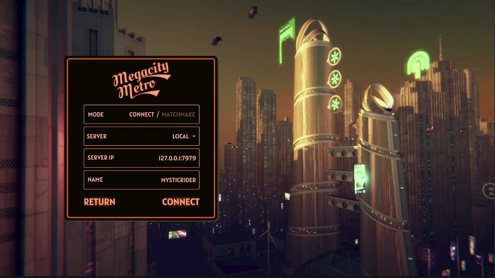
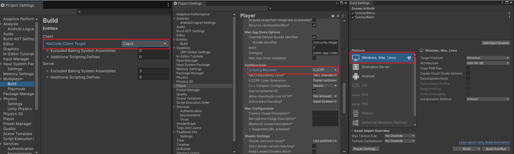

## Contents and Quick Links
- [Editor Local Multiplayer Setup (Without UGS)](#editor-local-multiplayer-setup-without-ugs)
- [Build Local Multiplayer Setup (Without UGS)](#build-local-multiplayer-setup-without-ugs)

## Multiplayer Setup

Megacity Metro is server-authoritative, which means the server has ultimate authority and control over the game's state and rules. To test the game, a server needs to be running, and clients need to connect to the server. This can be done in the Editor, locally, or through Multiplay Hosting.

---------------

### Editor Local Multiplayer Setup (Without UGS)

For testing purposes, you can run the Client and Server in the Editor. This enables inspection of entities, systems, components, etc. while running on both the Server and Client.

To set up the Editor for local multiplayer:
1. Go to **Project Settings** > **Multiplayer** > **Build**. 
2. Set the **NetCode Client Target** to `ClientAndServer`.
3. Open Multiplayer PlayMode Tools through, **Window** > **Multiplayer** > **PlayMode Tools**.
4. Set the **PlayMode Type** to `Client & Server`.

In the **Assets > Resources > MultiplayerServerSettings**, you have the ability to configure a server list that will be presented in the play mode Main Menu window. This functionality allows for the establishment of multiple connections and facilitates the use of the Default IP connection.

To begin, click the play button in the Unity Editor to launch the game. Once the game is running and you are in the Main Menu, change the mode to **Connect** in the Menu. From the **drop-down box**, select the desired server to establish a connection. If the desired server is not available in the list, you have the option to create a new entry and re-enter play mode. Alternatively, you can manually enter your own IP address using the provided text field.

By default, the project is configured to use the **Local** IP address. If you are testing the game in the Editor, selecting the Local IP option will allow you to run both the server and client within the Editor, enabling you to play the game.

Once you have selected the appropriate server and IP address, click the **Connect** button to initiate the connection process.

Now, when you play the game from the Editor, the Server and Client run together on your local machine. To inspect Client or Server entities, systems, etc., you can use the Entities window (**Window** > **Entities** > **Hierarchy**). For example, if you open **Entities Hierarchy**, you can select the desired **World** to inspect from the dropdown.

---------------

### Build Local Multiplayer Setup (Without UGS)

To build your game and test it locally, you need to build the Client and Server separately.

To make a Windows or Mac Client Build:
1. In the Editor, go to **Project Settings** > **Multiplayer** > **Entities** to change the **NetCode Client Target** to `Client`.
2. Go to **Project Settings** > **Player** and change **Scripting BackEnd** to `iL2CPP`.
3. Like any other Unity game, make the build by going to **File** > **Build Settings**.
4. Enable the `Main` and `Menu` scenes and set the target platform to `Windows, Mac, Linux`.
5. Press the **Build** button.

To make a Android Client Build: 
1. In the Editor, go to **Project Settings** > **Multiplayer** > **Entities** to change the **NetCode Client Target** to `Client`.
2. Go to **Project Settings** > **Player** and select the tab with Android icon change **Scripting BackEnd** to `iL2CPP`.
3. In the same window and in the **Target Architectures** check **ARM64** box.
3. Like any other Unity game, make the build by going to **File** > **Build Settings**.
4. Enable the `Main` and `Menu` scenes and set the target platform to `Android`.
5. Press the **Build** button.

To make an iOS Build: 
1. In the Editor, go to **Project Settings** >**Multiplayer**> **Entities** to change the **NetCode Client Target** to `Client`.
2. Like any other Unity game, make the build by going to **File** > **Build Settings**.
3. Press the **Build & Run** button to generate the Xcode project.

To make a Server Build:
1. Set the target platform to **Dedicated Server**.
2. Like the Client build, go to **File** > **Build Settings** and press the **Build** button.

