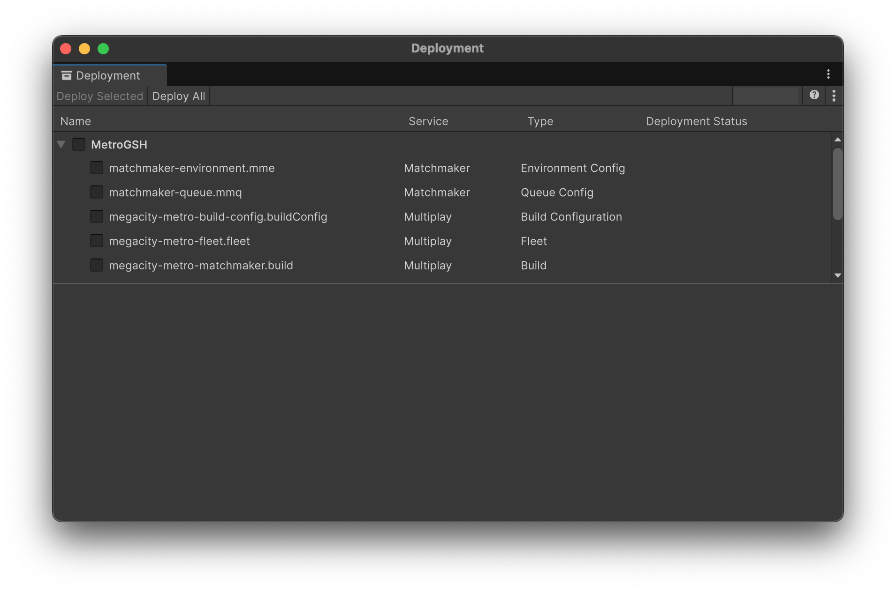
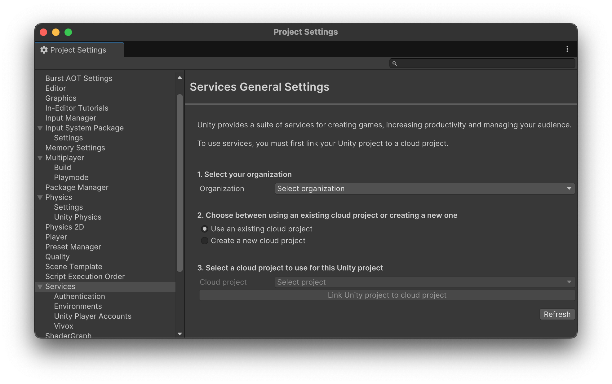
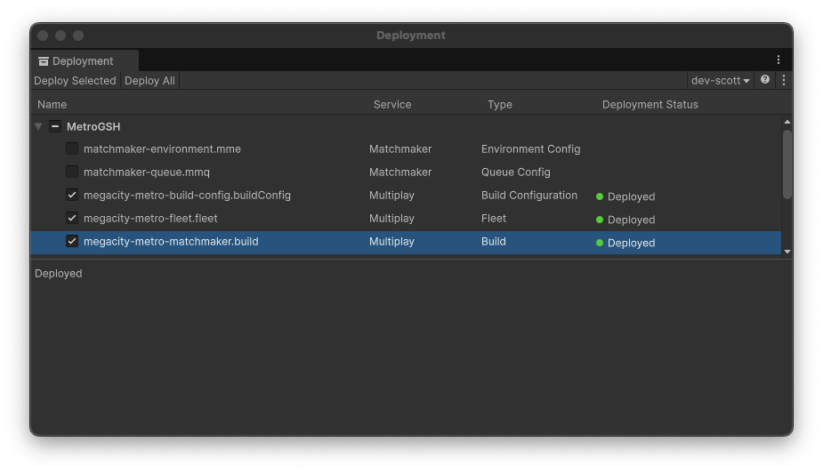
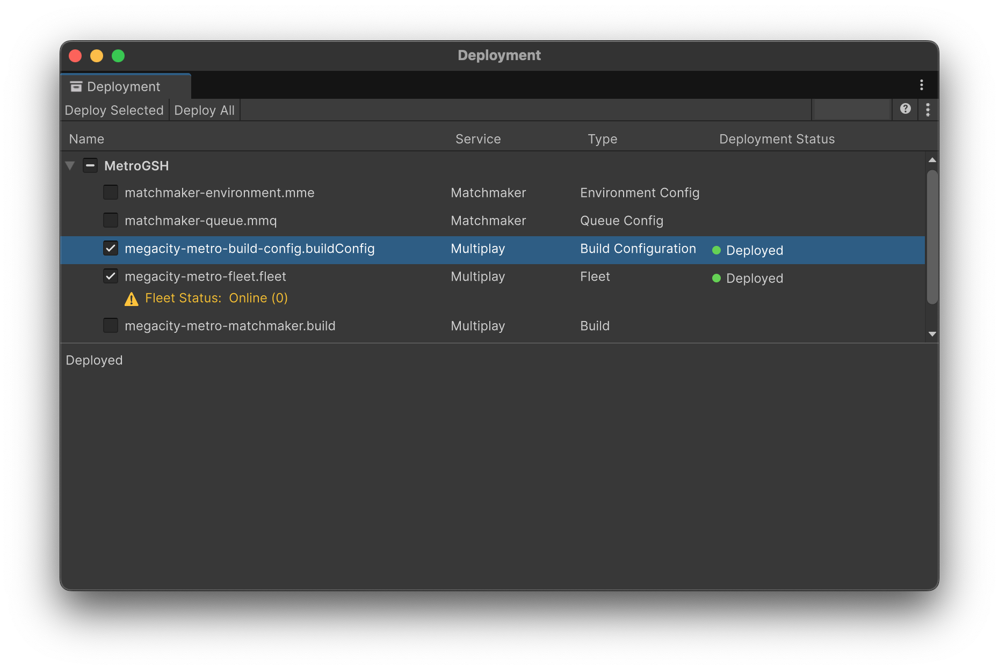
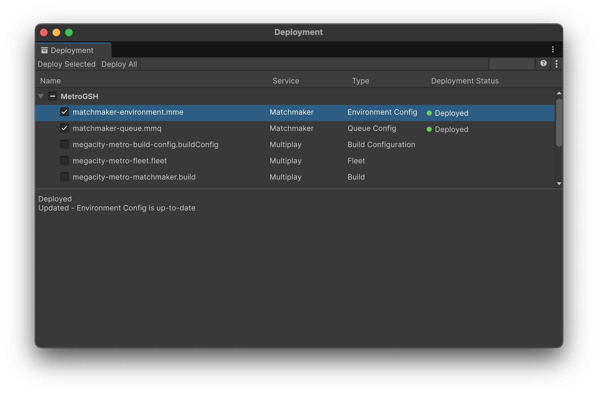
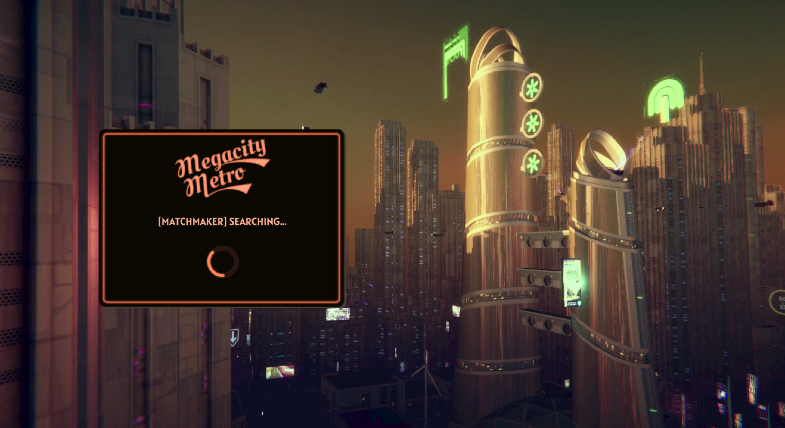

## Contents and Quick Links

- [Multiplayer Services SDK](#multiplayer-services-sdk)
- [Deployment](#deployment)
- [Multiplay Hosting (Game Server Hosting)](#multiplay-hosting-game-server-hosting)
- [Matchmaker](#matchmaker)
- [Vivox](#vivox)

## Add Unity Gaming Services (UGS)

Megacity Metro uses several services from UGS to facilitate connectivity between players. To use these services inside your project, you need a [Unity Account](https://docs.unity.com/ugs-overview/en/manual/creating-unity-ids) and to [create an organization](https://support.unity.com/hc/en-us/articles/208592876-How-do-I-create-a-new-Organization-) within the Unity dashboard.

While you can still adapt Megacity Metro to work without UGS, using these services and their related packages will provide an optimized multiplayer and developer experience as shown below.

### Deployment

Using the [Deployment](https://docs.unity3d.com/Packages/com.unity.services.deployment@1.0/manual/index.html) package and the default configuration files for Multiplay Hosting and Matchmaker located in the `Settings/UGS` folder lets you deploy builds and configure services in a few clicks, without leaving the Editor!

Navigate to **Services** > **Deployment** to open its window:

We will make use of this in the following sections.

### Multiplayer Services SDK

The [Multiplayer Services SDK](https://docs.unity3d.com/Packages/com.unity.services.multiplayer@1.0/manual/index.html) provides optimized service integrations, ongoing package updates, and less need for boilerplate. For dedicated game servers using Multiplay Hosting, the SDK also provides server lifecycle events, and built-in services for backfill and Server Query Protocol (SQP).

To use the SDK, navigate to **Edit > Project Settings > Service**. Choose your organization and project* then select **Link Unity Project to cloud project:**

\* If you do do not see a list of projects after selecting an organization, verify that your Unity account has either the Manager or Owner role in this organization.

### Multiplay Hosting (Game Server Hosting)

> **Prerequisite**: You must have [linked your Unity project](#multiplayer-services-sdk).

#### Step 1: Create a build

> **Note:** Your first deployment to Multiplay Hosting must include a Build type, unless you have already [created a build in Multiplay Hosting](https://docs.unity.com/ugs/en-us/manual/game-server-hosting/manual/guides/create-a-build).

To trigger your first deployment to Multiplay Hosting:
- Install **[Linux Dedicated Server](https://docs.unity3d.com/6000.0/Documentation/Manual/dedicated-server-requirements.html) Platform** to automatically upload it to the GSH.
  - **Note:** `Windows Dedicated Server` is not supported yet by the Deployment Window and GSH. 
- Navigate to `Build Profiles` and set the platform to `Linux Server` (this is required for Multiplay Hosting).
- Navigate to `Services > Deployment`.
- Select all configurations where **Multiplay** is the `Service`, or using the following `Type` values:
  - Build Configuration
  - Fleet
  - Build
- Press `Deploy Selected`.
- After the build and deployments are done, all three will show a successful green `Deployed` indicator and label:

#### Step 2: Deploy updates to Build Configuration and Fleet

Once a build exists in Multiplay Hosting, deployments can also be used to update service configurations by choosing only `Build Configuration` and/or `Fleet`:

Next, learn [how to configure Matchmaker](#matchmaker) or about [custom Multiplayer Hosting setups](gsh.md).

### Matchmaker

> **Prerequisite**: You must have [linked your Unity project](#multiplayer-services-sdk), and deployed both build and service configurations to Multiplay Hosting.

**Matchmaker** is a versatile tool that enables you to customize matches in your game. It offers fast and efficient matches, multi-region orchestration, and backfill options. With its flexible configuration, dynamic scalability, and robust rule engine, Matchmaker simplifies matchmaking while supporting complex game loops. To learn more, [get started with Matchmaker](https://docs.unity.com/ugs/manual/matchmaker/manual/get-started).

#### Deploy the Environment and Queue configurations

For Megacity Metro, we use the following Matchmaker configuration:

- Queue:
  - **Maximum players on a ticket**: 12
- Pool:
  - **Timeout**: 60 seconds
- Rules:
  > **Note:** These settings are focused on development and assume that your team will want to join one (1) server at any given time. The relaxation rule ensures adequate time between leaving and re-joining the same server to avoid backfill conflicts.
  - **Backfill enabled**: True
  - **Team name:** Arena Fighters
  - **Team count**
    - **Team count min**: 100
    - **Team count max**: 100
    - **Relaxation 1**: 
      - **Range Control** : Replace min 
      - **Ticket age tyep** : Oldest
      - **Replacement value** : 1
      - **At seconds** : 10
  - **Player count min**: 1
  - **Player count max**: 1

To deploy the default configurations provided for Megacity Metro:
- Navigate to `Services > Deployment`.
- Select the following configurations where **Matchmaker** is the `Service` and/or using the following `Type` values:
  - Environment Config
  - Queue Config
- Press `Deploy Selected`.
- Once done, both services will show a successful green `Deployed` indicator and label:

Learn more about:
- [Queues](https://docs.unity.com/ugs/en-us/manual/matchmaker/manual/advanced-topics-queues-pools#Queues)
- [Pools](https://docs.unity.com/ugs/en-us/manual/matchmaker/manual/advanced-topics-queues-pools#Pools)
- [Rules](https://docs.unity.com/ugs/en-us/manual/matchmaker/manual/matchmaking-rules-rules)

#### Test the game

Now that the build is deployed and configured in Multiplay Hosting and Matchmaker, click on the play button to start the game. To access the Matchmaking services, navigate to the main menu and select **"Matchmake"** mode, followed by clicking the **"Find Match"** button.

Once the "Find Match" button is clicked, the Matchmaking services will initiate the connection process with the server. During this time, a circular loading indicator will be presented to signify that the system is in the process of establishing the connection. Once the connection is established, you will be able to start gameplay.

### Vivox

**Vivox** is a voice chat service that enables players to communicate with each other in-game. To use [Vivox](https://unity.com/products/vivox), you need to connect your project to Vivox from the Unity Editor and enable Vivox in [Unity Cloud](https://cloud.unity.com/home).

For more information about Vivox, and how to use it you can read the [Vivox quickstart guide](https://docs.vivox.com/v5/general/unity/15_1_200000/en-us/Default.htm#Unity/vivox-unity-first-steps.htm).