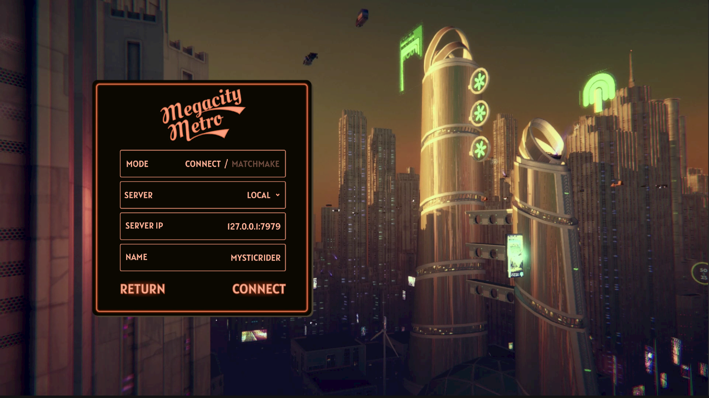
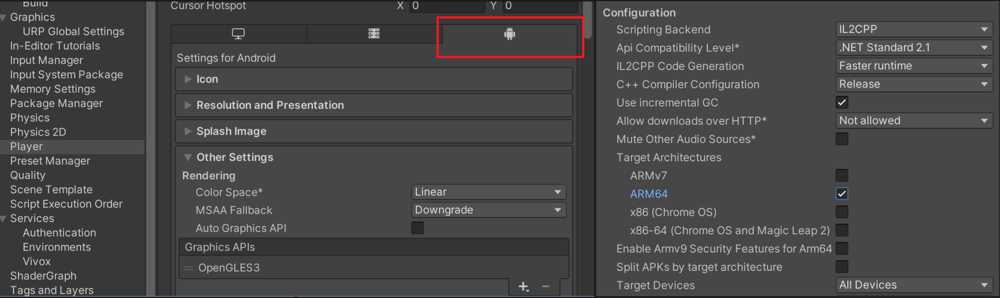
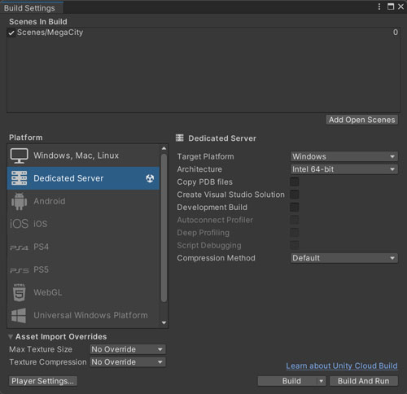
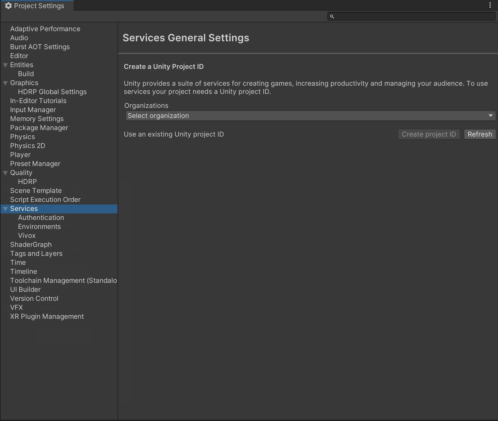

## Contents and Quick Links
- [Megacity-Metro Overview](#megacity-metro-overview)
- [Megacity-Metro Prerequisites](#megacity-metro-prerequisites)
  - [Recommended Specs for Mac](#recommended-specs-for-mac)
  - [Recommended Specs for Windows 10](#recommended-specs-for-windows-10)
  - [Recommended Specs for Android](#recommended-specs-for-android)
- [Important Note Before You Begin](#important-note-before-you-begin)
- [Get Megacity-Metro](#get-megacity-metro)
  - [Clone the Project](#clone-the-project)
- [Get Started](#get-started)
- [Multiplayer Setup](#multiplayer-setup)
  - [Editor Local Multiplayer Setup (Without UGS)](#editor-local-multiplayer-setup-without-ugs)
  - [Build Local Multiplayer Setup (Without UGS)](#build-local-multiplayer-setup-without-ugs)
- [Add Unity Gaming Services (UGS)](#add-unity-gaming-services-ugs)
  - [Game Server Hosting (Multiplay)](#game-server-hosting-multiplay)
  - [Matchmaker](#matchmaker)
  - [Vivox](#vivox)
- [Gameplay Controls](#gameplay-controls)
  - [Mouse and Keyboard](#mouse-and-keyboard)
- [Index of Resources in this Project](#index-of-resources-in-this-project)
  - [Gameplay](#gameplay)
  - [Audio](#audio)
  - [Connectivity](#connectivity)
  - [Services (Vivox, Matchmaker, etc.)](#services-vivox-matchmaker-etc)
  - [UI](#ui)
  - [Tools and Utilities](#tools-and-utilities)
- [Troubleshooting](#troubleshooting)
  - [Bugs](#bugs)
- [Disclaimer](#disclaimer)
- [License](#license)

## Megacity-Metro Overview

Megacity-Metro is an action-packed, shooter game based on the original Megacity sample. It leverages the power of Netcode for Entities for an immersive, multiplayer experience that can support 128+ players simultaneously. The latest DOTS packages and Unity Gaming Services (UGS) enhances the Megacity-Metro user experience. Megacity-Metro showcases how to create engaging and immersive multiplayer experiences with a suite of netcode and multiplayer tools, tech, and services. 

Some important points of this demo are:
- Large-scale streaming and rendering with the Entity Component System (ECS for Unity)
- 128+ players per game session
- Server-authoritative gameplay with feature prediction, interpolation, and lag compensation using Netcode for Entities
- Unity Gaming Services (UGS) integration for Game Server Hosting, Matchmaking, and Vivox voice chat
- Universal Render Pipeline (URP)
- Cross-platform support for Windows, Mac and Android

## Megacity-Metro Prerequisites

Megacity-Metro is compatible with Unity **2022 LTS** and is currently tested on Windows, Mac and Android. 
You can download the editor using the following link:
- Unity Website: [Download Unity LTS](https://unity.com/releases/lts)

### Recommended Specs for Mac
- Operating System: Mac OS X 10.15.7
- CPU: Intel(R) Core(TM) i7-9750H CPU @ 2.60GHz
- RAM: 32GB
- GPU: AMD Radeon Pro Vega 20
- Storage: 20GB

### Recommended Specs for Windows 10
- Operating System: Windows 10 64bit
- CPU: Intel(R) Core(TM) i7-9750H CPU @ 2.60GHz
- RAM: 32GB
- GPU: NVIDIA GeForce GTX 1650 with Max-Q Design
- Storage: 20GB

### Recommended Specs for Android 
- Operating Systems: Android 13 or Higher
- CPU: Snapdragon 8 Gen 2
- RAM: 4GB 
- GPU: Adreno 740
- Storage: 2GB 

## Important Note Before You Begin

The Megacity-Metro sample is large, so the **first time** cloning and playing the sample may take more time than expected. Subsequent plays should load much quicker because of caching.

First time clone and load time estimates:
- Cloning the Megacity-Metro repo: Up to 20 min
- Opening the project with library build: Up to 20 min
- When going into the playmode, server world is created: Up to 30 min
- Building the project for each platform for the first time: Up to 50 min 

## Get Megacity-Metro

To get the Megacity-Metro sample, you can clone the project using Git. **Please note that direct download of the project is not currently supported for this repository**.

### Clone the Project

Before you can clone the project, you must install Git Large File Support (LFS). Megacity-Metro uses Git LFS to handle all large assets required locally. Refer to [Git LFS installation options](https://github.com/git-lfs/git-lfs/wiki/Installation) for instructions on Windows and Mac. 

## Get Started

After you clone the project, follow these steps to start playing:
1. Install a compatible Unity Editor version. During install make sure to include ,Windows/Mac Build Support (IL2CPP), Windows/Mac Dedicated Server Build Support, Android Build Support and Linux Dedicated Server Build Support.
2. To add the project to the **Unity Hub**, click the **Add** button and select the root folder of the cloned project.

3. Open the **Menu** scene located in `Assets/Scenes/Menu`. The first time you start the game through menu it will take more time to load the content of the **Main** scene.To avoid that, you can open the Main scene located in `Assets/Scenes/Main`.  
4. Click the **Play** button to start.

5. Start the Single Player mode. Multiplayer requires more setup which will be explained next.  

  
## Multiplayer Setup

Megacity-Metro is server-authoritative, which means the server has ultimate authority and control over the game's state and rules. To test the game, a server needs to be running, and clients need to connect to the server. This can be done in the Editor, locally, or through Game Server Hosting (Multiplay).

---------------

### Editor Local Multiplayer Setup (Without UGS)

For testing purposes, you can run the Client and Server in the Editor. This enables inspection of entities, systems, components, etc. while running on both the Server and Client.

To set up the Editor for local multiplayer:
1. Go to **Project Settings** > **Entities**. 
2. Set the **NetCode Client Target** to `ClientAndServer`.
3. Open Multiplayer PlayMode Tools from **Multiplayer** > **Window: PlayMode Tools**. 
4. Set the **PlayMode Type** to `Client & Server`.

In the **Assets > Resources > MultiplayerServerSettings**, you have the ability to configure a server list that will be presented in the play mode Main Menu window. This functionality allows for the establishment of multiple connections and facilitates the use of the Default IP connection.

To begin, click the play button in the Unity Editor to launch the game. Once the game is running and you are in the Main Menu, change the mode to **Connect** in the Menu. From the **drop-down box**, select the desired server to establish a connection. If the desired server is not available in the list, you have the option to create a new entry and re-enter play mode. Alternatively, you can manually enter your own IP address using the provided text field.

By default, the project is configured to use the **Local** IP address. If you are testing the game in the Editor, selecting the Local IP option will allow you to run both the server and client within the Editor, enabling you to play the game.

Once you have selected the appropriate server and IP address, click the **Connect** button to initiate the connection process.

Now, when you play the game from the Editor, the Server and Client run together on your local machine. To inspect Client or Server entities, systems, etc., you can use the Entities window (**Window** > **Entities** > **Hierarchy**). For example, if you open **Entities Hierarchy**, you can select the desired **World** to inspect from the dropdown.

---------------

### Build Local Multiplayer Setup (Without UGS)

To build your game and test it locally, you need to build the Client and Server separately.

To make a Windows Client Build:
1. In the Editor, go to **Project Settings** > **Entities** to change the **NetCode Client Target** to `Client`.
2. Go to **Project Settings** > **Player** and change **Scripting BackEnd** to `iL2CPP`.
3. Like any other Unity game, make the build by going to **File** > **Build Settings**.
4. Enable the `Main` and `Menu` scenes and set the target platform to `Windows, Mac, Linux`.
5. Press the **Build** button.

To make a Android Client Build: 
1. In the Editor, go to **Project Settings** > **Entities** to change the **NetCode Client Target** to `Client`.
2. Go to **Project Settings** > **Player** and select the tab with Android icon change **Scripting BackEnd** to `iL2CPP`.
3. In the same window and in the **Target Architectures** check **ARM64** box.
3. Like any other Unity game, make the build by going to **File** > **Build Settings**.
4. Enable the `Main` and `Menu` scenes and set the target platform to `Android`.
5. Press the **Build** button.

To make a Server Build:
1. Set the target platform to **Dedicated Server**.
2. Like the Client build, go to **File** > **Build Settings** and press the **Build** button.

## Add Unity Gaming Services (UGS)

Megacity-Metro uses several services from UGS to facilitate connectivity between players. To use these services inside your project, you need a [Unity Account](https://docs.unity.com/ugs-overview/en/manual/creating-unity-ids) and [create an organization](https://support.unity.com/hc/en-us/articles/208592876-How-do-I-create-a-new-Organization-) within the Unity Dashboard.

You can still use Megacity-Metro without UGS, but for a better multiplayer experience, it is recommended to use the following services:

### Game Server Hosting (Multiplay)

**Game Server Hosting**, formerly known as Multiplay, is a robust and flexible infrastructure for hosting multiplayer games. It ensures a smooth operation of your game by delivering proven performance and scalability. With Game Server Hosting, you can launch your multiplayer titles with confidence, knowing that you have the support of a reliable global platform. The enables you to spend less time troubleshooting and more time building your game with the help of comprehensive documentation, samples, and software development kits (SDKs) designed for interoperability. To get started with Game Server Hosting, refer to the official [documentation](https://docs.unity.com/game-server-hosting/en/manual/guides/get-started).

**Warning**: Game Server Hosting is a pay-as-you-go service with a free tier. You must sign up for UGS services with a credit card to start using Game Server Hosting. If you exceed the [free tier usage allowance](https://unity.com/solutions/gaming-services/pricing), you will be charged. See our [Billing FAQ](https://support.unity.com/hc/en-us/articles/6821475035412-Billing-FAQ) to learn more.

To use Game Server Hosting in your project, you need to [Integrate the Game Server Hosting](https://docs.unity.com/game-server-hosting/manual/guides/get-started#Integrat) service from the [Unity Cloud](https://cloud.unity.com/home).

**Note**: You must be an Owner or Manager of your organization to enable Game Server Hosting.

After you integrate Game Server Hosting, you must create a [build](https://docs.unity.com/game-server-hosting/manual/guides/get-started#Create), a [build configuration](https://docs.unity.com/game-server-hosting/manual/guides/get-started#Create2), a [fleet](https://docs.unity.com/game-server-hosting/manual/guides/get-started#Create3), and a [test allocation](https://docs.unity.com/game-server-hosting/manual/guides/get-started#Create4).

**Tip**: Check out our YouTube video [How to set up Game Server Hosting](https://www.youtube.com/watch?v=oN2c9teXi7M).

For Megacity-Metro, we use the following Game Server Hosting setting:

For **Build Configuration**: 

- **Query Type**: `SQP`
- **Launch parameters**: `-ip $$ip$$ -port $$port$$ -queryport $$query_port$$ -logFile $$log_dir$$/$$timestamp$$-Engine.log`

For **Fleet**: 
- **Server Per Machine** : `1` 

### Matchmaker

**Matchmaker** is a versatile tool that enables you to customize matches in your game. It offers fast and efficient matches, multi-region orchestration, and backfill options. With its flexible configuration, dynamic scalability, and robust rule engine, Matchmaker simplifies matchmaking while supporting complex game loops. For more information, consult the [Matchmaker Quick Start Guide](https://docs.unity.com/matchmaker/en/manual/matchmaker-quick-start).

To use Matchmaker in your project, you must **Enable** and **Integrate** the Matchmaker service from the [Unity Cloud](https://cloud.unity.com/home).

For Megacity-Metro, we use the following Matchmaker configuration:

Creating the [queue](https://docs.unity.com/matchmaker/en/manual/advanced-topics-queues-pools#Queues):
- **Maximum players on a ticket**: 12

Creating a default [pool](https://docs.unity.com/matchmaker/en/manual/advanced-topics-queues-pools#Pools):
- **Timeout**: 60 seconds

For Matchmaker [rules](https://docs.unity.com/matchmaker/manual/matchmaking-rules-rules), we use the following configuration:
- **Backfill enabled**: true 
- **Team count min**: 1
- **Team count max**: 1
- **Player count min**: 200
- **Player count max**: 200
- **Relaxation 1**: 
  - **Range Control** : Replace min 
  - **Ticket age tyep** : Oldest
  - **Replacement value** : 1
  - **At seconds** : 10

After configuring the services on the dashboard website, navigate to **Edit > Project Settings > Service** and choose your organization and project ID.

Next, click on the play button to initiate the game. To access the Matchmaking services, navigate to the main menu and select **"Matchmake"** mode, followed by clicking the **"Find Match"** button.

Once the "Find Match" button is clicked, the Matchmaking services will initiate the connection process with the server. During this time, a circular loading indicator will be presented to signify that the system is in the process of establishing the connection. Once the connection is established, you will be able to start gameplay.

### Vivox

**Vivox** is a voice chat service that enables players to communicate with each other in-game. To use [Vivox](https://unity.com/products/vivox), you need to connect your project to Vivox from the Unity Editor and enable Vivox in the [Unity Cloud](https://cloud.unity.com/home).

For more information about Vivox, and how to use it you can read the [Vivox quickstart guide](https://docs.vivox.com/v5/general/unity/15_1_200000/en-us/Default.htm#Unity/vivox-unity-first-steps.htm).
## Gameplay Controls

### Mouse and Keyboard

| Input        | Action       |
|--------------|--------------|
| Mouse Movement / Arrow Keys | Steering |
| Left Click / Space | Shoot |
| W/S | Thrust / Reverse |
| A/D | Steering |
| E/Q | Roll |
| Tab | LeaderBoard |
| V | Toggle Vivox |
| P | Netcode Panel Stats |
| ESC| in game menu |

## Index of Resources in this Project

### Gameplay
- [Vehicle Input System](Megacity-Metro/Assets/Scripts/Gameplay/Player/PlayerVehicleInputSystem.cs)
- [PlayerVehicleJobs](Megacity-Metro/Assets/Scripts/Gameplay/Player/Jobs/PlayerVehicleJobs.cs)
- [SetupPlayerInfoSystem](Megacity-Metro/Assets/Scripts/Gameplay/Player/SetupPlayerInfoSystem.cs)
- [ShootingSystem](Megacity-Metro/Assets/Scripts/Gameplay/Shooting/ShootingSystem.cs)
- [BoundSystem](Megacity-Metro/Assets/Scripts/Gameplay/Misc/BoundsSystem.cs)
- [SpawnPoint](Megacity-Metro/Assets/Scripts/Gameplay/Misc/MonoBehaviours/SpawnPoint.cs)
- [UpdatePlayerRankSystem](Megacity-Metro/Assets/Scripts/Gameplay/Player/UpdatePlayerRankSystem.cs)

### Audio
- [AudioMaster](Megacity-Metro/Assets/Scripts/Gameplay/Audio/MonoBehaviours/AudioMaster.cs)

### Connectivity
- [NetcodeBootstrap](Megacity-Metro/Assets/Scripts/Gameplay/Netcode/NetcodeBootstrap.cs)

### Services (Vivox, Matchmaker, etc.)
- [VivoxManager](Megacity-Metro/Assets/Scripts/Gameplay/Vivox/MonoBehaviours/VivoxManager.cs)
- [ClientMatchmaker](Megacity-Metro/Assets/Scripts/UGS/Client/ClientMatchmaker.cs)
- [GameServerManager](Megacity-Metro/Assets/Scripts/UGS/Server/GameServerManager.cs)

### UI
- [HUD](Megacity-Metro/Assets/Scripts/Gameplay/UI/MonoBehaviours/HUD/HUD.cs)
- [MainMenu](Megacity-Metro/Assets/Scripts/Gameplay/UI/MonoBehaviours/MainMenu/MainMenu.cs)
- [UIGameSettings](Megacity-Metro/Assets/Scripts/Gameplay/UI/MonoBehaviours/Settings/UIGameSettings.cs)

### Tools and Utilities
- [NetcodePanelStats](Megacity-Metro/Assets/Scripts/Utils/NetcodeExtensions/UI/NetcodePanelStats.cs)

## Troubleshooting

### Bugs

Report bugs in Megacity Multiplayer using GitHub [issues](https://github.cds.internal.unity3d.com/unity/Megacity-Metro/issues). If the bugs are related to the Entities packages, use the Entities GitHub issues.

## Disclaimer

This repository does not accept pull requests, GitHub review requests, or any other GitHub-hosted issue management requests.

## License

Megacity Metro is licensed under the Unity Companion License. See [LICENCE](LICENCE.md) for more legal information.
